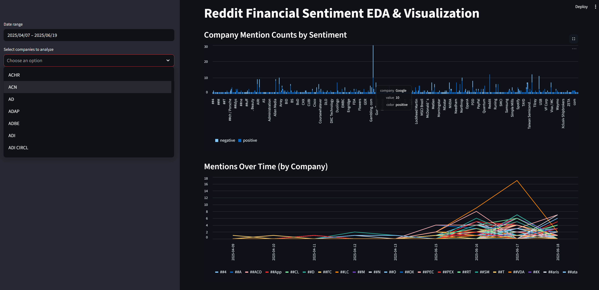
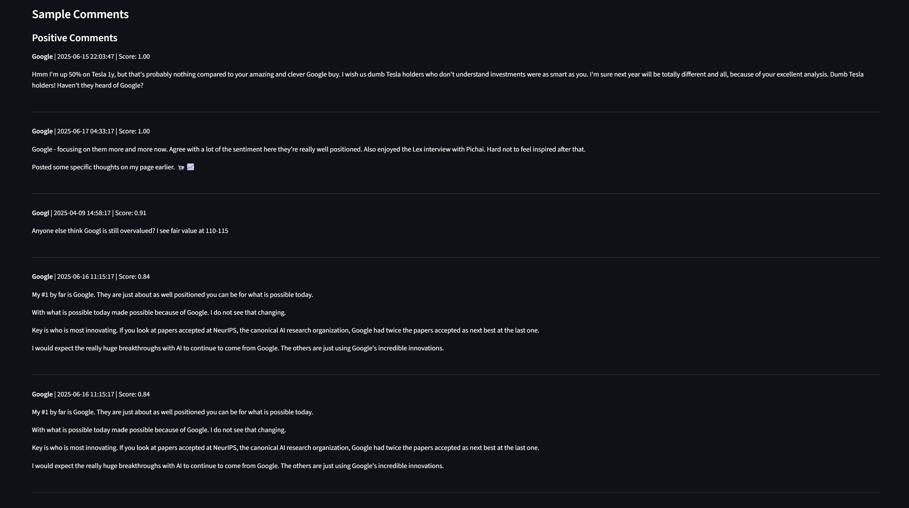

# Reddit Financial Sentiment Analyzer

This project scrapes Reddit posts and comments from a specified subreddit, identifies company mentions using Named Entity Recognition (NER), and analyzes the sentiment of each post/comment. The results are saved for further analysis, making it useful for financial research, sentiment tracking, and investment insights.

## Features

- **Reddit Scraping**: Collects posts and comments from a target subreddit using the Reddit API (PRAW).
- **Company Recognition**: Uses Hugging Face NER models to identify company names and tickers in text.
- **Financial Sentiment Analysis**: Uses DistilRoBERTa model fine-tuned on financial news (98.23% accuracy) to classify sentiment with detailed confidence scores.
- **Custom Ticker List**: Matches company mentions against a comprehensive ticker list.
- **Output**: Saves results (including company mentions and sentiment) to JSON and CSV files for further analysis.

## How it Looks

Below are example visualizations generated by the analytics dashboard:

### Mentions Over Time


### Positive & Negative Word Clouds


### Sample Comments


## Folder Structure

```
Sentiment/
│
├── src/
│   ├── __init__.py
│   ├── execute_scraper.py
│   ├── RedditNLPAnalyzer.py
│   ├── backend_api.py
│   ├── analytics_app.py
│   ├── convert_json_to_parquet.py
│
├── data/
│   ├── raw/
│   │   └── comments_with_classification.json
│   ├── processed/
│   │   └── comments_with_classification.parquet
│
├── notebooks/                  # Jupyter or exploratory notebooks (optional)
│
├── SupportingFiles/
│   └── company_tickers.json
│
├── Example/
│   ├── Mentions over Time.png
│   ├── Positive & Negative Word Clouds.png
│   └── Sample Comments.png
│
├── setup_env_vars.sh
├── .gitignore
├── README.md
```

## Requirements

- Python 3.7+
- [PRAW](https://praw.readthedocs.io/) (Reddit API)
- [transformers](https://huggingface.co/transformers/) (Hugging Face pipelines)
- pandas
- numpy
- requests
- psutil
- fuzzywuzzy

You can install the dependencies with:

```bash
pip install praw transformers pandas numpy requests psutil fuzzywuzzy
```

## Setup

1. **Reddit API Credentials**:  
   Create a Reddit app at [https://www.reddit.com/prefs/apps](https://www.reddit.com/prefs/apps) and set the following environment variables:
   - `REDDIT_CLIENT_ID`
   - `REDDIT_CLIENT_SECRET`
   - `REDDIT_USER_AGENT`

   **For Windows WSL Users:**
   1. Set the environment variables in Windows (System Properties > Environment Variables)
   2. Run the provided setup script to automatically configure WSL environment:
   ```bash
   ./setup_env_vars.sh
   ```
   This will add the necessary environment variable exports to your `.bashrc` file.

2. **Company Ticker List**:  
   Ensure `SupportingFiles/company_tickers.json` exists. This file should be a JSON object mapping tickers to company names.

## Usage

Run the main script from the project root:

```bash
python src/execute_scraper.py
```